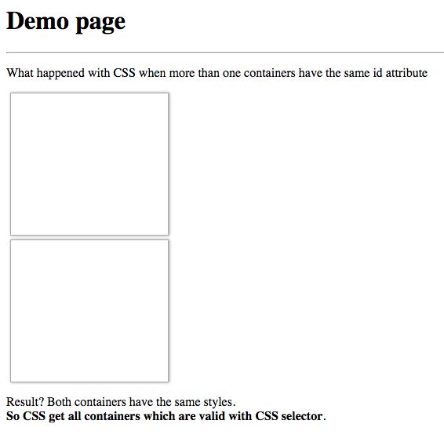

# test-what-happened-with-css-when-more-than-one-containers-have-the-same-id-attribute

📒 Test of CSS behaviour with two containers with the same ID attribute.

## Screenshot of demo



## Code

```html
<style>
    #test {
        width: 200px;
        height: 180px;
        border: 1px solid #aaa;
        box-shadow: 1px 0 4px #999;
        margin: 5px;
    }
</style>

<div id="test"></div>
<div id="test"></div>
```

## License

[The MIT License](https://piecioshka.mit-license.org) @ 2016
