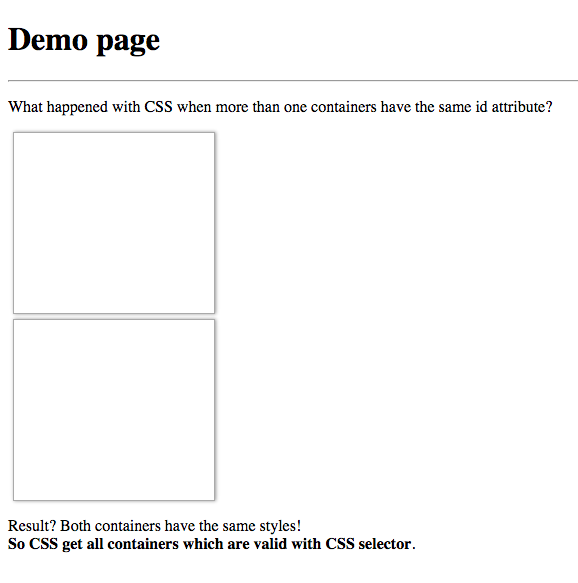

# test-what-happened-with-css-when-more-than-one-containers-have-the-same-id-attribute

> :ledger: Test of CSS behaviour with two containers with the same ID attribute.

## Demo

2016 @ Piotr Kowalski
